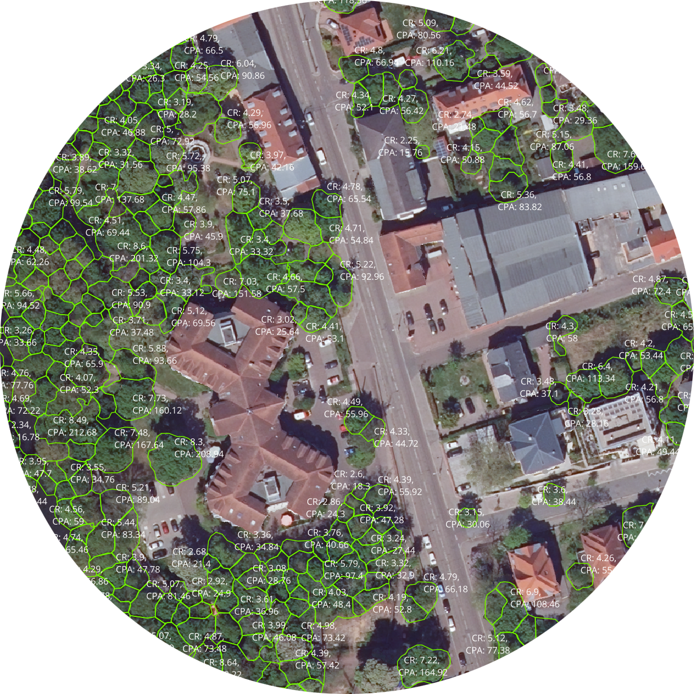

 <div align="center" style="text-align:center">
  <h1 > DeepTrees 🌳</h1>
  <b>End-to-end pipeline for tree crown delineation and analysis in high-resolution DOP images based on U-Net.</b>  
    <br>

</div>

This repository is based on https://github.com/AWF-GAUG/TreeCrownDelineation. The original repository is licensed under the MIT License. The original repository was forked and modified to work with the data provided by UFZ for the project "Deep Learning for Tree Crown Delineation". The added functionality includes data processing, training and further downstream processing of the original repository. We have also added a semantic versioning system to the repository, and the repository is licensed under the Prosperity Public License 3.0.0.

## Installation

To install the package, clone the repository and install the dependencies.

```bash
git clone https://codebase.helmholtz.cloud/ai-consultants-dkrz/DeepTrees.git
cd DeepTrees
pip install -r requirements.txt
```
or from pip.

```bash
pip install deeptrees
```

## Documentation


# Training

This document outlines the steps for working with the TreeCrownDelineation model on Levante.

## Setup

### Code

Check out branch `finetune-halle` from the forked TreeCrownDelineation repository (https://codebase.helmholtz.cloud/ai-consultants-dkrz/TreeCrownDelineation/).

### Environment

Install the required libraries in a conda environment:

```bash
conda create -n deeptree python=3.12
conda activate deeptree

conda install -c conda-forge gdal==3.9.2 pip
pip install -r requirements.txt
```

## Preprocessing

### Directory structure

The root folder is `/work/ka1176/shared_data/2024-ufz-deeptree/polygon-labelling/`. Sync the folder `tiles` and `labels` with the labeled tiles provided by UFZ. The unlabeled tiles go into `pool_tiles`.

```
|-- tiles
|   |-- tile_0_0.tif
|   |-- tile_0_1.tif
|   |-- ...
|-- labels
|   |-- label_tile_0_0.shp
|   |-- label_tile_0_1.shp
|   |-- ...
|-- pool_tiles
|   |-- tile_4_7.tif
|   |-- tile_4_8.tif
|   |-- ...
```

Create the new empty directories

```
|-- masks
|-- outlines
|-- dist_trafo
```

### Preparation

We will follow the instructions in the TreeCrownDelineation repository to fine tune the models. Link: https://github.com/AWF-GAUG/TreeCrownDelineation

## Training

Adapt your own config file based on the defaults in `train_halle.yaml` as needed. For inspiration for a derived config file for finetuning, check `finetune_halle.yaml`.

Run the script like this:

```bash
python scripts/train.py # this is the default config that trains from scratch
python scripts/train.py --config-name=finetune_halle # finetune with pretrained model
python scripts/train.py --config-name=yourconfig # with your own config
```

To re-generate the ground truth for training, make sure to pass the label directory in `data.ground_truth_labels`. To turn it off, pass `data.ground_truth_labels=null`.

You can overwrite individual parameters on the command line, e.g.

```bash
python scripts/train.py trainer.fast_dev_run=True
```

To resume training from a checkpoint, take care to pass the hydra arguments in quotes to avoid the shell intercepting the string (pretrained model contains `=`):

```bash
python scripts/train.py 'model.pretrained_model="Unet-resnet18_epochs=209_lr=0.0001_width=224_bs=32_divby=255_custom_color_augs_k=0_jitted.pt"'
```

## Inference

Run the inference script with the corresponding config file. Adjust as needed.

```bash
python scripts/test.py --config-name=inference_halle
```

## Separate ground truth data generation

1. Combine all labels into one shapefile `all_labels.shp`. Make sure the coordinate reference system is `EPSG:25832` to comply with the tiles.

```python
import glob
import pandas as pd
import geopandas as gpd

shapes = np.sort(glob.glob('/work/ka1176/shared_data/2024-ufz-deeptree/polygon-labelling/labels/label_tile_*.shp'))
all_polygons = pd.concat([gpd.read_file(shape).set_crs(epsg=4326).to_crs(epsg=25832) for shape in shapes])
all_polygons.to_file('/work/ka1176/shared_data/2024-ufz-deeptree/polygon-labelling/labels/all_labels.shp')
```

2. Create the raster image tiles: skip, they are provided by UFZ. These files should be in `tiles`.

3. Rasterize the delineated tree crowns. We are working in `~treecrowndelineation/scripts`.

```python
python rasterize.py -i /work/ka1176/shared_data/2024-ufz-deeptree/polygon-labelling/tiles/* -o /work/ka1176/shared_data/2024-ufz-deeptree/polygon-labelling/masks/mask_ -shp /work/ka1176/shared_data/2024-ufz-deeptree/polygon-labelling/labels/all_labels.shp
```

4. Create the outlines.

```python
python rasterize.py -i /work/ka1176/shared_data/2024-ufz-deeptree/polygon-labelling/tiles/* -o /work/ka1176/shared_data/2024-ufz-deeptree/polygon-labelling/outlines/outline_ -shp /work/ka1176/shared_data/2024-ufz-deeptree/polygon-labelling/labels/all_labels.shp --outlines
```

5. Create the distance transform.

```python
python rasterize_to_distance_transform.py -i /work/ka1176/shared_data/2024-ufz-deeptree/polygon-labelling/tiles/* -o /work/ka1176/shared_data/2024-ufz-deeptree/polygon-labelling/dist_trafo/dist_trafo_ -shp /work/ka1176/shared_data/2024-ufz-deeptree/polygon-labelling/labels/all_labels.shp
```

6. Check that everything was processed correctly. Run the notebook `notebooks/processing/quick_data_check.ipynb` for a visual inspection.

## Logs

View the MLFlow logs that were created during training.

On a Levante login node in VSCode, run the following command, exchanging the file path to your personal directory.

```bash
source ~/.bashrc
conda activate deeptree
mlflow server --host 127.0.0.1 --port 6006 --backend-store-uri file:///work/ka1176/caroline/gitlab/TreeCrownDelineation/logs/mlruns/
```

## Semantic Versioning
This reposirotry has auto semantic versionining enabled. To create new releases, we need to merge into the default `finetuning-halle` branch. 

Semantic Versionining, or SemVer, is a versioning standard for software ([SemVer website](https://semver.org/)). Given a version number MAJOR.MINOR.PATCH, increment the:

- MAJOR version when you make incompatible API changes
- MINOR version when you add functionality in a backward compatible manner
- PATCH version when you make backward compatible bug fixes
- Additional labels for pre-release and build metad

See the SemVer rules and all possible commit prefixes in the [.releaserc.json](.releaserc.json) file. 

| Prefix | Explanation                                                                                                                                                                                                                                     | Example                                                                                              |
| ------ | ----------------------------------------------------------------------------------------------------------------------------------------------------------------------------------------------------------------------------------------------- | ---------------------------------------------------------------------------------------------------- |
| feat   | A new feature was implemented as part of the commit, <br>so the [Minor](https://mobiuscode.dev/posts/Automatic-Semantic-Versioning-for-GitLab-Projects/#minor) part of the version will be increased once <br>this is merged to the main branch | feat: model training updated                                            |
| fix    | A bug was fixed, so the [Patch](https://mobiuscode.dev/posts/Automatic-Semantic-Versioning-for-GitLab-Projects/#patch) part of the version will be <br>increased once this is merged to the main branch                                         | fix: fix a bug that causes the user to not <br>be properly informed when a job<br>finishes |

The implementation is based on. https://mobiuscode.dev/posts/Automatic-Semantic-Versioning-for-GitLab-Projects/


# License

This repository is licensed under the Prosperity Public License 3.0.0. For more information, see the [LICENSE.md](LICENSE.md) file.

# Sources

M. Freudenberg, P. Magdon, and N. Nölke: Individual tree crown delineation in high-resolution remote sensing images based on U-Net, NCAA, Springer, 2022, https://doi.org/10.1007/s00521-022-07640-4.